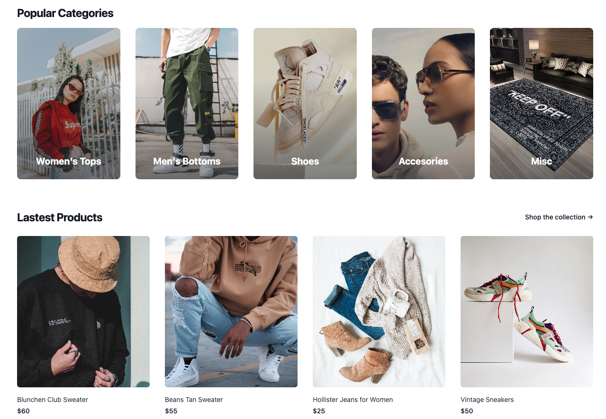

# **Thredz**
## **Date**: 03/03/2023
### **By**: Anatoliy Agadzhanov, Frederick Caione, Hyun Bin Yim
#### [Anatoliy's GitHub](https://github.com/yesanatoliy) | [Anatoliy's LinkedIn](https://www.linkedin.com/in/anatoliy-agadzhanov-5a2a54173/) | [Freddy's GitHub](https://github.com/fcaione) | [Freddy's LinkedIn](https://www.linkedin.com/in/frederickcaione) | [HB's GitHub](https://github.com/hby77) | [HB's LinkedIn](https://www.linkedin.com/in/hyunbinyim/)
***
### ***Description***
Thredz is an e-commerce app where users can create their own profiles to post and sell their products locally or through delivery. It also doubles as a social app where users can interact with each other through commenting on listings and viewing each others profiles. Through this app we hope to promote reusability, reselling and thrift culture in order to combat fast fashion.

***
### ***Technologies Used***
* PostgreSQL
* Express
* React
* Node.js
* CSS
    * Tailwind
* Firebase

***
### ***Screenshots***

#### **image header 1**

***
### ***Future Updates***
- [ ] Add saved listings feature
- [ ] Add followers/following feature
- [ ] Add customizable profile banner
- [x] Add file upload

***
### ***Credits***

Project notion board: [Notion](https://en.wikipedia.org/wiki/File:Good_Food_Display_-_NCI_Visuals_Online.jpg)

Components Diagram: [lucid.io](https://lucid.app/lucidchart/b98f06ca-4fc9-43a8-b0b2-fe184611df5b/edit?viewport_loc=-193%2C-91%2C2328%2C1119%2C0_0&invitationId=inv_87f1b4c8-aa5b-4746-9488-350373655d06)

Styling library: [Tailwind css](https://tailwindcss.com/)

Custom logos: [Canva](canva.com)

Cloud storage: [Firebase](firebase.google.com)

Images: [unsplash.com searches](unsplash.com), [tailwind](https://tailwindcss.com)